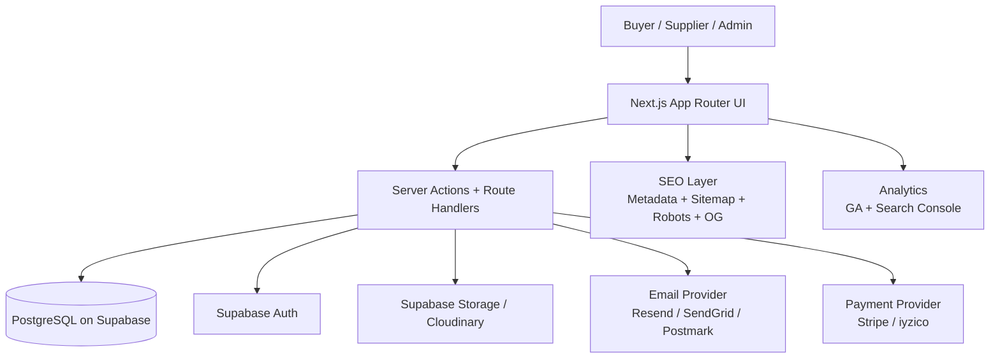
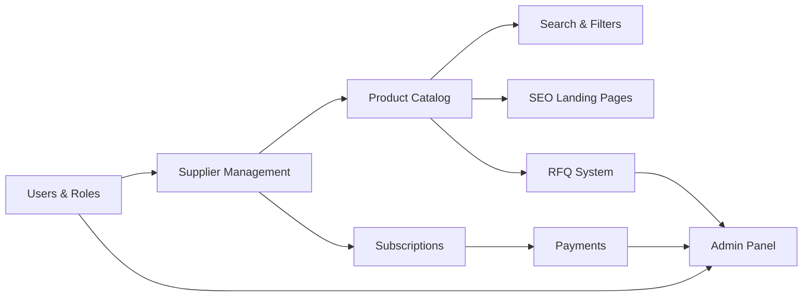
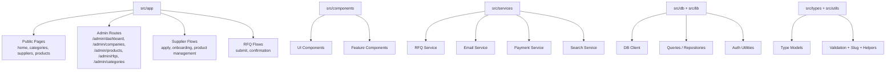
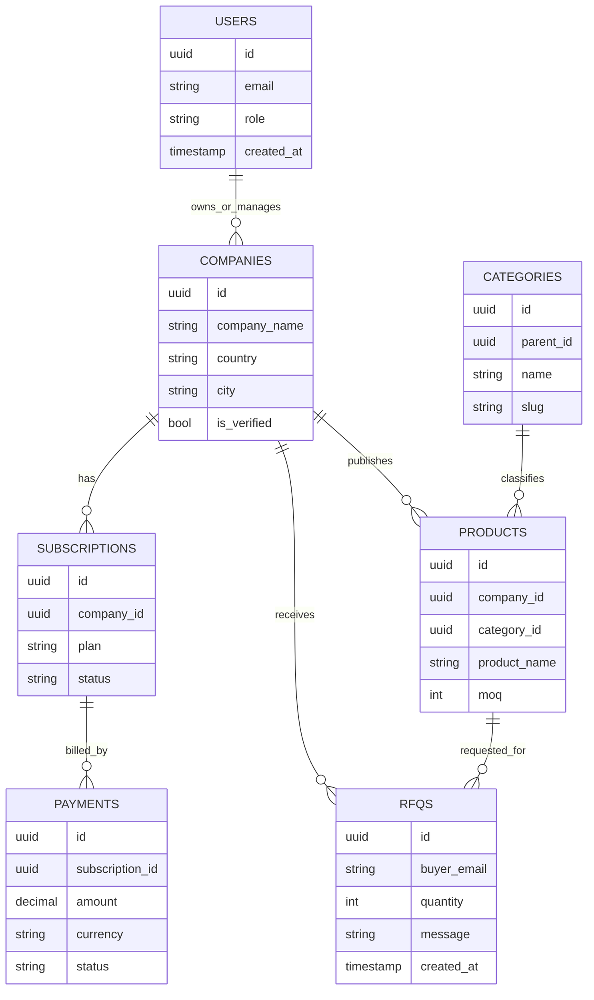
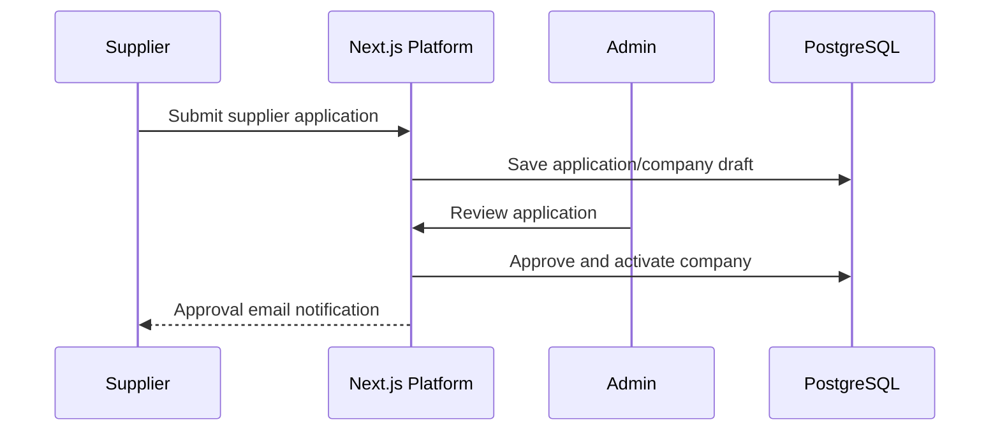
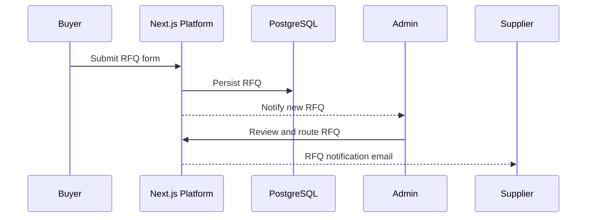
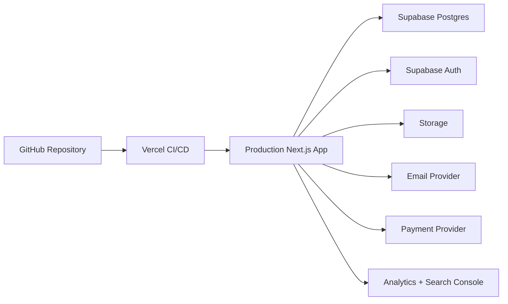

# Turkey Manufacturers Platform - Architecture

This architecture is derived from:
- `PROJECT_CHECKLIST.md`
- `docs/modules.md`
- `docs/database-schema.md`
- `docs/roadmap.md`

It is written in Markdown + Mermaid so it is viewable in both:
- GitHub (Markdown renderer with Mermaid)
- VS Code (Markdown Preview)

## 1. High-Level System Architecture

## 2. Core Domain Modules

## 3. Application Layer (Next.js Folder-Oriented)

## 4. Data Model Relationships

## 5. Key Workflows

### Supplier Onboarding

### RFQ Flow

## 6. Deployment Architecture

## 7. Checklist-to-Architecture Mapping

- Public pages and directory structure: `PROJECT_CHECKLIST.md` sections 6, 12, 19
- Supplier onboarding workflow: sections 13, 18
- Product catalog and search: sections 14, 17
- RFQ lifecycle and notifications: sections 15, 16
- Database schema and slugs: sections 9, 10
- Deployment and domain: sections 21, 22
- Launch criteria and growth: sections 23, 24
